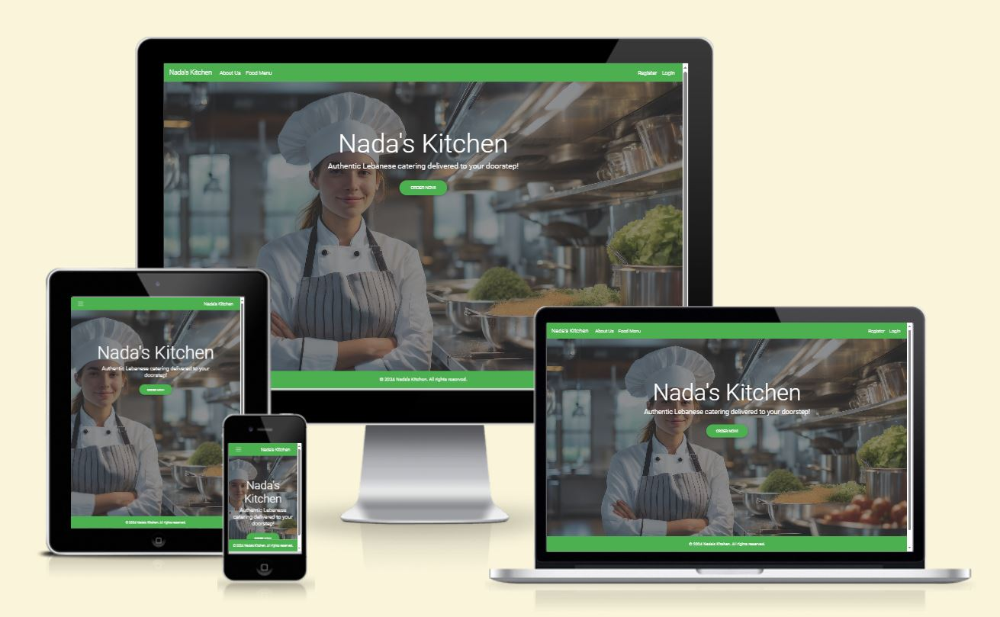

# Nada's Kitchen

Nada's Kitchen is a fictional catering business located Dublin, Ireland. The app is a kitchen app that takes customer orders 48 hours in advance. The app is designed to allow customers to view the food menu and place orders online. It also provides customers with a simple, easy to use ordering system that connects to their registered profile.
The live link can be found here: [Live Site - Nada's Kitchen](https://nadas-cuisine-ca42fb816afa.herokuapp.com/)

## Table of Contents
- [Sizzle and Steak](#nada's-kitchen)
    - [Table of Contents](#table-of-contents)
- [User-Experience-Design](#user-experience-design)
    - [The-Strategy-Plane](#the-strategy-plane)
    - [Site-Goals](#site-goals)
    - [Agile Planning](#agile-planning)

# User-Experience-Design

## The-Strategy-Plane

### Site-Goals

The site is aimed to help customers make quick orders from the UI without the need to call the catering company, while enabling the business staff to add menu items from the backend and an enhanced capability to delete a menuitem from the UI. 

The site enables customers to create, view and update their login profiles to aid customer contact and delivery addresses.  

### Agile Planning

This project was developed using agile methodologies by delivering small features in incremental sprints. 
There were 3 sprints in total.

The project enabled issues, prioritized under the labels, Must have, should have, could have and won't have. Labels were assigned to sprints and story pointed according to complexity. "Must have" stories were completed first, "should haves" and then finally "could haves". It was done this way to ensure that all core requirements were completed first, however, the sprints were completed concurrently due to granular requirements that may have been placed on hold until a complete solution was developed.

The Kanban board was created using github projects and can be located [here](https://github.com/users/jjsemaan/projects/4) and can be viewed to see more information on the project cards. All issues have a full set of acceptance criteria in order to define the functionality that marks that issue as complete.

